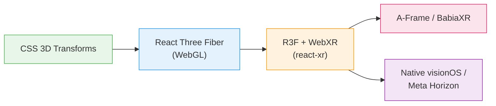
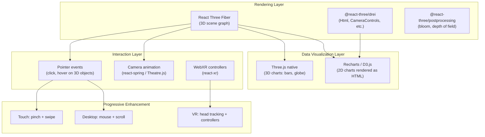
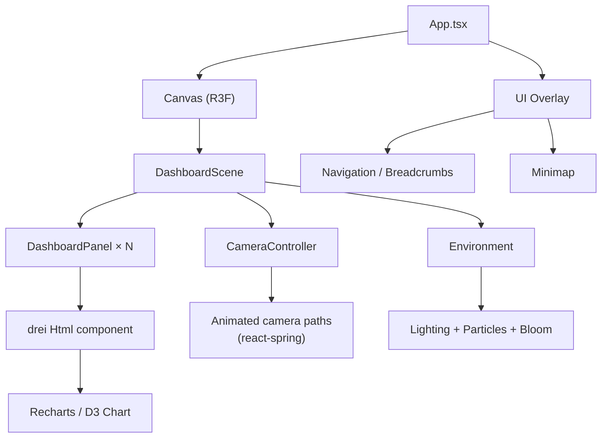
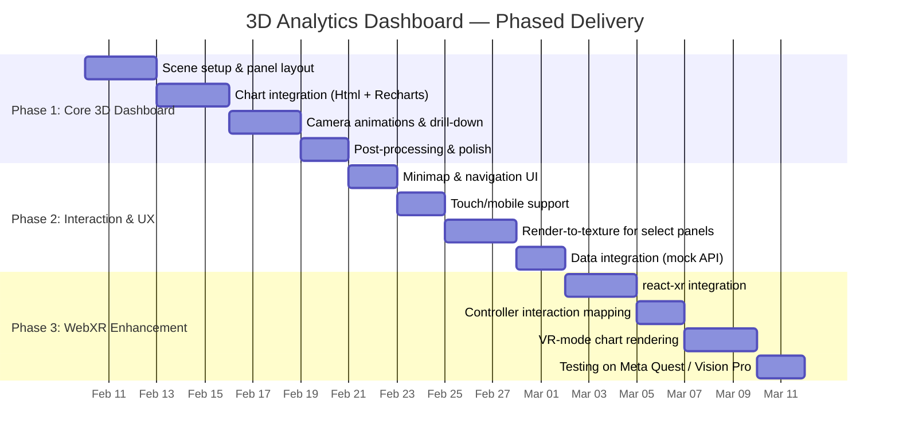

# 3D Spatial UI for Data Analytics Dashboards

## Research Report & Implementation Options

**Prepared for:** Accion Labs — Innovation R&D **Date:** February 2026 **Author:** Claude (Research Assistant)

---

## 1. Executive Summary

This report explores how three-dimensional spatial interfaces can enhance the interactive impact of data analytics dashboards. The core concept — rendering multiple dashboard views simultaneously in a 3D environment where users can zoom, navigate, and drill down spatially — sits at the intersection of **immersive analytics**, **spatial computing**, and **progressive web experiences**.

The research field has matured significantly since 2020, with major players like Tableau, Microsoft, and Flow Immersive investing in spatial data visualization. Meanwhile, the open-source ecosystem around React Three Fiber and WebXR has reached a level of maturity that makes browser-to-XR progressive enhancement genuinely feasible for production use.

This report covers existing initiatives, evaluates technology approaches across a spectrum from lightweight CSS3D to full WebXR, and recommends a phased implementation strategy that delivers demo impact quickly while building toward a productizable offering.

---

## 2. The Concept: Why 3D Dashboards?

Traditional BI dashboards are constrained by 2D screen real estate. Users tab between views, lose context during drill-downs, and can only compare a limited number of visualizations simultaneously. Research from the Immersive Analytics community identifies several specific advantages of spatializing data views:

|Challenge in 2D Dashboards|How 3D Spatial UI Addresses It|
|---|---|
|Limited simultaneous views|Multiple panels arranged in 3D space (arc, sphere, room)|
|Context loss during drill-down|Camera flies to detail view while overview remains visible in peripheral space|
|Flat comparison of correlated data|Depth axis encodes an additional data dimension|
|Cognitive overload from tabs/pages|Spatial memory helps users recall "where" information lives|
|Presentation lacks engagement|Cinematic camera movements create narrative flow through data|

Academic research supports this. The concept of "space to think" (Andrews et al., 2010) demonstrates that spatially organizing analytical materials enhances information synthesis and recall. Immersive environments leverage spatial memory, a capability humans evolved for navigating physical spaces but that traditional 2D interfaces fail to exploit.

---

## 3. Existing Initiatives & Prior Art

### 3.1 Commercial Products

|Product|Approach|Platform|Key Relevance|
|---|---|---|---|
|**Tableau on Vision Pro**|Native visionOS app with 3D globes, 2D charts in spatial windows|Apple Vision Pro|Enterprise BI vendor validating spatial analytics; user studies showed positive reception for spatial data layouts|
|**Flow Immersive**|No-code spatial data visualization with narrative steps|Browser + Smart Glasses + VR|Closest commercial product to our concept; supports progressive enhancement from web to XR|
|**Cognitive3D**|Spatial analytics platform with custom dashboards|VR/AR headsets|Provides analytics _about_ spatial experiences; dashboard customization relevant to our UX thinking|
|**Microsoft SandDance**|Animated transitions between data visualization layouts|Browser (2D with 3D-like transitions)|Pioneered the "flying data points" paradigm that inspires drill-down transitions|
|**JSAR (Spatial Browser Engine)**|Open-source engine for arranging web pages in 3D space|Desktop + XR|Directly addresses "3D infinite canvas" for web content; relevant architectural model|

### 3.2 Academic & Research Projects

|Project|Institution/Source|Key Contribution|
|---|---|---|
|**ImAxes**|Monash University|Embodied axes for multivariate data viz in VR; users physically grab and arrange axes|
|**DataHop**|Based on "memory palace" principle|Maps data panels to spatial features; users navigate data by walking through virtual environments|
|**BabiaXR**|Open-source, A-Frame based|Toolset for building 3D data visualizations with experiment support; HTML-centric approach|
|**CompositingVis** (IEEE 2024)|CHI research|Creating composite visualizations in immersive environments; directly relevant to multi-view spatial dashboard|

### 3.3 Key Academic Findings

The research converges on several important design principles:

- **2D charts in 3D space work well.** Rather than making every chart 3D, the consensus is to place familiar 2D visualizations as panels within a 3D spatial layout. This combines the readability of 2D charts with the spatial organization benefits of 3D.
    
- **Spatial memory is real and powerful.** Users remember _where_ they placed or found information in 3D space, which aids recall and reduces re-navigation.
    
- **Transitions are the killer feature.** Animated camera movements between views create narrative flow and maintain spatial context during drill-downs — exactly the experience described in our concept.
    
- **Progressive enhancement is essential.** Not all users have XR hardware. The most successful systems start with a browser experience and enhance for headsets.
    

---

## 4. Technology Landscape

### 4.1 Technology Stack Options

The following diagram maps the spectrum of approaches from lightweight to fully immersive:

### 4.2 Detailed Comparison

|Criteria|CSS 3D Transforms|React Three Fiber (R3F)|R3F + react-xr (WebXR)|A-Frame / BabiaXR|
|---|---|---|---|---|
|**3D Depth**|2.5D perspective effects|True 3D scene graph|True 3D + VR/AR|True 3D + VR/AR|
|**HTML Content in 3D**|Native (DOM elements)|Via drei `<Html>` component|Via drei `<Html>` component|DOM overlay / a-frame-htmlembed|
|**Camera Animation**|Limited (CSS transitions)|Full programmatic control|Full + head tracking|Full + head tracking|
|**React/TypeScript**|Native|Native (R3F is a React renderer)|Native|Adapter needed (aframe-react)|
|**Performance**|Excellent (GPU compositing)|Good (WebGL)|Good (WebGL + XR loop)|Good (Three.js under the hood)|
|**XR Support**|None|Possible (with react-xr)|Built-in|Built-in|
|**Effort to Demo**|Low (days)|Medium (1–2 weeks)|Medium-High (2–3 weeks)|Medium (1–2 weeks)|
|**Interactive Charts**|Full DOM (Recharts, D3, etc.)|Rendered to texture or Html overlay|Rendered to texture or Html overlay|Limited|
|**Wow Factor**|Medium|High|Very High|High|
|**Productizability**|Limited|High|Very High|Medium|

### 4.3 Key Technology Components

---

## 5. Implementation Options

### Option A: CSS 3D Perspective Dashboard (Lightweight Demo)

**Concept:** Use CSS 3D transforms to arrange multiple dashboard panels in a perspective-corrected 3D space. Panels tilt, zoom, and transition using CSS animations. Drill-down triggers a smooth perspective shift to bring a panel to the foreground.

**Architecture:**

- Standard React + TypeScript app with Tailwind CSS
- Dashboard panels are regular DOM elements with `transform: perspective()`, `rotateY()`, `translateZ()`
- Charts rendered with Recharts or D3 (fully interactive DOM)
- Transitions via CSS `transition` or Framer Motion
- No WebGL, no canvas — pure DOM

**Strengths:**

- Fastest to build (3–5 days for a polished demo)
- Charts remain fully interactive DOM elements (tooltips, hover, click)
- Works on every browser, including mobile
- Excellent performance (GPU-composited layers)

**Limitations:**

- No true 3D environment (2.5D only)
- Limited camera freedom (no orbital control)
- No path to VR/AR
- Perspective effects are approximate, not geometrically accurate

**Best for:** Quick internal demo, proof-of-concept for non-technical stakeholders.

---

### Option B: React Three Fiber Spatial Dashboard (Recommended)

**Concept:** A true 3D scene where dashboard panels float as rectangular planes in space. The camera is animated to fly between views. Charts are rendered as HTML overlays tied to 3D positions using drei's `<Html>` component. The 3D environment includes ambient lighting, subtle particle effects, and post-processing (bloom, depth of field) for cinematic impact.

**Architecture:**

**Key Technical Approaches:**

- **Panel Layout:** Panels arranged in an arc (180° or 360°), a grid on a curved surface, or a room-like arrangement. Configurable at runtime.
- **Drill-Down Navigation:** Clicking a chart triggers `react-spring` to animate the camera to a position directly in front of that panel, while simultaneously spawning sub-panels (detail views) around the focused panel.
- **HTML-in-3D:** drei's `<Html>` component projects DOM elements to 3D coordinates. Charts remain fully interactive React components. The `occlude` prop can hide HTML behind 3D geometry.
- **Post-Processing:** Unreal Bloom for a sci-fi glow on active panels; Depth of Field to blur unfocused panels, guiding visual attention.
- **Render-to-Texture (advanced):** For better 3D integration, charts can be rendered to an off-screen canvas and mapped as textures onto 3D planes. This enables proper lighting, reflections, and occlusion but sacrifices DOM interactivity.

**Strengths:**

- True 3D with full camera control (orbit, fly-through, automated paths)
- Fully interactive charts via `<Html>` overlay
- React + TypeScript throughout — aligns with Accion's stack
- Rich ecosystem (drei, react-spring, postprocessing)
- Extensible to WebXR (see Option C)
- High wow factor with relatively manageable effort

**Limitations:**

- `<Html>` overlay is a visual trick (HTML floats above WebGL canvas, not truly embedded in 3D)
- Performance requires care with many simultaneous panels (limit to ~8–12 visible panels)
- WebGL context is a single canvas — no native DOM event bubbling inside it

**Estimated Effort:** 2–3 weeks for a polished demo with 5–8 dashboard views, animated transitions, and post-processing effects.

**Best for:** Client/investor presentations, innovation summit demos, basis for productizable offering.

---

### Option C: R3F + WebXR Progressive Enhancement (Full Vision)

**Concept:** Builds on Option B, adding WebXR support so the same app works in a browser and in VR headsets. In browser mode, users navigate with mouse/touch. In VR mode (Meta Quest, Apple Vision Pro via WebXR), users look around the data room, point at panels with controllers, and drill down with hand gestures.

**Additional Architecture on top of Option B:**

- `@react-three/xr` wraps the Canvas with XR session management
- Controller input mapped to the same interaction model (point + click = drill down)
- Spatial audio cues for transitions (optional)
- DOM overlay for 2D UI in AR mode

**Strengths:**

- Single codebase, progressive from browser → VR → AR
- Demonstrates cutting-edge spatial computing capability
- Strongest "wow factor" for headset-equipped audiences
- Positions Accion at the frontier of enterprise data UX

**Limitations:**

- WebXR support varies by browser (Chrome best, Safari limited)
- HTML overlay (`<Html>`) doesn't work in VR mode — charts must be render-to-texture
- Testing requires headset hardware or the Meta Immersive Web Emulator extension
- Additional 1–2 weeks of effort beyond Option B

**Estimated Effort:** 3–5 weeks total (incremental on top of Option B).

**Best for:** Innovation showcases, Apple Vision Pro / Meta Quest demos, productizable spatial analytics platform.

---

### Option D: A-Frame + BabiaXR (Alternative for Rapid XR Prototyping)

**Concept:** Use A-Frame's HTML-first approach to build the spatial dashboard as custom HTML tags. BabiaXR provides data visualization components that plug directly into A-Frame scenes.

**Strengths:**

- HTML-centric — approachable for developers less experienced with 3D
- BabiaXR provides ready-made 3D chart components (bar, pie, scatter)
- Built-in WebXR support
- Active academic community and research backing

**Limitations:**

- Less React-native (requires adapter like aframe-react)
- TypeScript support is weaker than R3F ecosystem
- BabiaXR charts are less polished than Recharts/D3
- Smaller ecosystem and community than R3F
- Harder to integrate with existing React-based dashboards

**Estimated Effort:** 2–3 weeks.

**Best for:** Rapid XR prototype if VR is the primary target; less ideal if browser experience matters equally.

---

## 6. Comparative Summary

|Dimension|Option A (CSS 3D)|Option B (R3F) ⭐|Option C (R3F + WebXR)|Option D (A-Frame)|
|---|---|---|---|---|
|**Wow Factor**|⬛⬛⬜⬜⬜|⬛⬛⬛⬛⬜|⬛⬛⬛⬛⬛|⬛⬛⬛⬜⬜|
|**Practical UX**|⬛⬛⬛⬛⬜|⬛⬛⬛⬛⬜|⬛⬛⬛⬛⬛|⬛⬛⬛⬜⬜|
|**Tech Showcase**|⬛⬛⬜⬜⬜|⬛⬛⬛⬛⬜|⬛⬛⬛⬛⬛|⬛⬛⬛⬜⬜|
|**Productizability**|⬛⬛⬜⬜⬜|⬛⬛⬛⬛⬜|⬛⬛⬛⬛⬛|⬛⬛⬜⬜⬜|
|**Time to Demo**|⬛⬛⬛⬛⬛|⬛⬛⬛⬜⬜|⬛⬛⬜⬜⬜|⬛⬛⬛⬜⬜|
|**React/TS Fit**|⬛⬛⬛⬛⬛|⬛⬛⬛⬛⬛|⬛⬛⬛⬛⬛|⬛⬛⬜⬜⬜|

---

## 7. Recommended Approach: Phased Delivery

Given that all four objectives matter (wow factor, practical UX, tech showcase, productizability), the recommendation is to pursue **Option B as the foundation, with Option C as a progressive enhancement layer**, delivered in phases.

### Phase 1 (Week 1–2): Core 3D Dashboard

Deliver a browser-based R3F scene with 5–8 floating dashboard panels, animated camera transitions, and post-processing effects. Charts are interactive HTML overlays. This alone is demo-ready.

### Phase 2 (Week 2–3): Interaction & UX Polish

Add navigation UI (minimap, breadcrumbs), mobile/touch support, and render-to-texture for panels that need better 3D integration. Connect to a mock data API.

### Phase 3 (Week 3–5): WebXR Enhancement

Layer in `react-xr` for VR/AR support. Convert key charts to render-to-texture for VR mode. Test on Meta Quest and/or Apple Vision Pro.

---

## 8. Core Technology Stack (Recommended)

|Layer|Technology|Purpose|
|---|---|---|
|**Framework**|React 18+ with TypeScript|Application framework|
|**Build Tool**|Vite|Fast dev server with HMR|
|**3D Rendering**|React Three Fiber (`@react-three/fiber`)|Three.js as React components|
|**3D Helpers**|`@react-three/drei`|Html overlay, CameraControls, Environment, Text|
|**Animation**|`@react-spring/three`|Physics-based camera and object animation|
|**Post-Processing**|`@react-three/postprocessing`|Bloom, depth of field, vignette|
|**Charts**|Recharts + D3.js|2D charts rendered as HTML overlays|
|**XR (Phase 3)**|`@react-three/xr`|WebXR session management, controllers|
|**Styling**|Tailwind CSS|UI overlay styling|
|**State Management**|Zustand|Lightweight state for navigation, active panel, etc.|

---

## 9. Risks & Mitigations

|Risk|Impact|Mitigation|
|---|---|---|
|HTML overlay doesn't feel "truly 3D"|Medium — seams visible at extreme angles|Use `occlude="blending"` in drei; fall back to render-to-texture for key panels|
|Performance with many panels|High — frame drops break immersion|Limit visible panels to 8–12; use LOD (Level of Detail); lazy-load off-screen panels|
|WebXR browser support gaps|Medium — Safari/iOS limited|Progressive enhancement: browser-first, XR as bonus; use Immersive Web Emulator for testing|
|Chart interactivity in VR mode|High — DOM events don't work in VR|Use raycasting + render-to-texture; provide controller-based selection|
|Motion sickness in VR|Medium — camera animations can cause nausea|Use comfort-mode options: snap transitions, vignette during movement, user-controlled pacing|

---

## 10. Demo Data Suggestion

For maximum impact, the demo should use a data domain that is visually rich and universally understandable. Suggestions:

- **SaaS Business Metrics Dashboard:** Revenue, churn, cohort analysis, customer acquisition funnel — directly relevant to Accion's client base
- **Global Analytics:** Geographic data on a 3D globe (leveraging Three.js globe rendering) with drill-down to regional charts
- **IT Operations / AIOps:** Server health, incident timelines, dependency graphs — aligns with Accion's AIOps PoC work

---

## 11. Conclusion

The convergence of mature WebGL frameworks (React Three Fiber), standardizing WebXR APIs, and growing enterprise interest in spatial computing (Tableau, Flow Immersive) creates a timely opportunity for Accion Labs to demonstrate 3D spatial analytics as a differentiating capability.

The recommended approach — React Three Fiber with progressive WebXR enhancement — delivers:

- **Immediate demo impact** through cinematic 3D camera movements and floating dashboard panels
- **Practical UX value** via spatial context preservation during drill-downs and multi-view comparison
- **Technical credibility** showcasing React/TypeScript, WebGL, and WebXR expertise
- **Product potential** as a reusable spatial analytics framework for enterprise clients

The phased delivery model ensures value at each stage while building toward the full vision.

---

## 12. References

### Commercial Products & Platforms

1. **Tableau on Apple Vision Pro** — Exploring Spatial Computing and Immersive Analytics with Vision Pro. https://www.tableau.com/blog/exploring-spatial-computing-and-immersive-analytics-vision-pro
    
2. **Flow Immersive** — Turn Data Into an Experience Over Your Table. Browser, XREAL, and Quest support. https://flowimmersive.com/
    
3. **Cognitive3D** — 3D Analytics Platform; Custom Dashboards for XR Analytics (Oct 2024). https://cognitive3d.com/blog/webxr/
    
4. **Cognitive3D Custom Dashboards Launch** — Coverage by Auganix (Oct 2024). https://www.auganix.org/vr-news-cognitive3d-launches-custom-dashboards-to-enhance-spatial-data-analytics-for-xr/
    

### Spatial Browser & Infrastructure

5. **JSAR — Spatial Web Browser Engine** — Open-source browser engine for immersive 3D browsing (Apache 2.0). https://github.com/jsar-project/runtime
    
6. **Understanding the Spatial Web Browser Engine** — JSAR architecture deep dive. https://m-creativelab.github.io/jsar-runtime/blogs/spatial-browser-engine.html
    
7. **Rethinking the Web: Inside the Spatial Browser Engine (JSAR)** — DEV Community overview (Sep 2025). https://dev.to/yorkie/rethinking-the-web-inside-the-spatial-browser-engine-jsar-aco
    

### Academic Research & Surveys

8. **Immersive Analytics: Time to Reconsider the Value of 3D for Information Visualisation** — Springer, Marriott et al. https://link.springer.com/chapter/10.1007/978-3-030-01388-2_2
    
9. **Immersive Analytics: Theory and Research Agenda** — Skarbez, Polys, et al. (PMC / Frontiers in Robotics and AI). https://pmc.ncbi.nlm.nih.gov/articles/PMC7805807/
    
10. **A Survey of Immersive Visualization: Focus on Perception and Interaction** — ScienceDirect (Nov 2023). https://www.sciencedirect.com/science/article/pii/S2468502X23000499
    
11. **Immersive Analytics with Abstract 3D Visualizations: A Survey** — Interactive survey browser by dbvis. https://iasurvey.dbvis.de/
    
12. **Overview of Immersive Data Visualization: Enhancing Insights and Engagement Through Virtual Reality** — IJIST (Jun 2024). https://www.researchgate.net/publication/381926511_Overview_of_Immersive_Data_Visualization_Enhancing_Insights_and_Engagement_Through_Virtual_Reality
    
13. **Immersive Analytics in Critical Spatial Domains: From Materials to Energy Systems** — Khadka (2025), Wiley. https://analyticalsciencejournals.onlinelibrary.wiley.com/doi/abs/10.1002/cem.70076
    
14. **BabiaXR: Facilitating experiments about XR data visualization** — ScienceDirect (Nov 2023). https://www.sciencedirect.com/science/article/pii/S2352711023002832
    
15. **A New Generation of Collaborative Immersive Analytics on the Web** — MDPI Future Internet (Apr 2024). https://www.mdpi.com/1999-5903/16/5/147
    

### React Three Fiber Ecosystem

16. **React Three Fiber** — Official documentation. A React renderer for Three.js (pmndrs). https://docs.pmnd.rs/react-three-fiber
    
17. **React Three Fiber** — GitHub repository. https://github.com/pmndrs/react-three-fiber
    
18. **drei** — Useful helpers for react-three-fiber (pmndrs). GitHub repository. https://github.com/pmndrs/drei
    
19. **drei Html Component** — Documentation for embedding HTML content in 3D scenes. https://drei.docs.pmnd.rs/misc/html
    
20. **3D Data Visualization with React and Three.js** — Peter Beshai / Cortico (Medium, Jan 2020). https://medium.com/cortico/3d-data-visualization-with-react-and-three-js-7272fb6de432
    
21. **How to Build Stunning 3D Scenes with React Three Fiber** — Varun Vachhar. https://varun.ca/modular-webgl/
    
22. **Building a Realistic 3D Monitor with Reflections and HTML Interface using React Three Fiber** — DEV Community (Jun 2025). https://dev.to/blamsa0mine/building-a-realistic-3d-monitor-with-reflections-and-html-interface-using-react-three-fiber-4dcj
    
23. **Creating an Immersive 3D Weather Visualization with React Three Fiber** — Codrops (Sep 2025). https://tympanus.net/codrops/2025/09/18/creating-an-immersive-3d-weather-visualization-with-react-three-fiber/
    
24. **Add 3D to Your Web Projects with v0 and React Three Fiber** — Vercel Blog. https://vercel.com/blog/add-3d-to-your-web-projects-with-v0-and-react-three-fiber
    
25. **React Three Fiber Examples** — Official examples gallery. https://r3f.docs.pmnd.rs/getting-started/examples
    

### WebXR & A-Frame

26. **Immersive Web Developer Home** — W3C Immersive Web Working Group resources and samples. https://immersiveweb.dev/
    
27. **A-Frame — VR Headsets & WebXR Browsers** — Documentation on WebXR support. https://aframe.io/docs/1.7.0/introduction/vr-headsets-and-webxr-browsers.html
    
28. **Progressive Enhancement in A-Frame** — James Luong (Medium, Jul 2023). https://medium.com/@jamesluong23/progressive-enhancement-in-a-frame-f76610b2c7cb
    
29. **Immersive Web Emulator** — Meta's browser extension for WebXR development without hardware. https://developers.meta.com/horizon/blog/webxr-development-immersive-web-emulator/
    
30. **What Is WebXR? The Future of VR and AR on the Web** — Comprehensive overview (Oct 2025). https://wpdean.com/what-is-webxr/
    
31. **Cross-platform AR/VR With the Web: WebXR with A-Frame, Angular, and Capacitor** — Ionic Blog (May 2025). https://ionic.io/blog/cross-platform-ar-vr-with-the-web-webxr-with-a-frame-angular-and-capacitor
    

### CSS 3D Transforms

32. **Beautiful CSS 3D Transform Perspective Examples** — Polypane. https://polypane.app/css-3d-transform-examples/
    
33. **How CSS Perspective Works** — CSS-Tricks (Sep 2020). https://css-tricks.com/how-css-perspective-works/
    
34. **Perspective — Intro to CSS 3D Transforms** — David DeSandro. https://3dtransforms.desandro.com/perspective
    
35. **perspective** — MDN Web Docs (CSS reference). https://developer.mozilla.org/en-US/docs/Web/CSS/Reference/Properties/perspective
    

### AWS & Cloud XR

36. **How to Create a VR Application with User Insights using AWS Amplify and WebXR** — AWS Spatial Computing Blog (Sep 2023). https://aws.amazon.com/blogs/spatial/how-to-create-a-vr-application-with-user-insights-using-aws-amplify-and-webxr/
    
37. **AWS Spatial Computing Blog — XR** — Collection of spatial computing resources. https://aws.amazon.com/blogs/spatial/tag/xr/