# 3D Spatial UI for Data Analytics Dashboards

## Research Report & Implementation Options

**Prepared for:** Accion Labs — Innovation R&D **Date:** February 2026 **Author:** Claude (Research Assistant)

---

## 1. Executive Summary

This report explores how three-dimensional spatial interfaces can enhance the interactive impact of data analytics dashboards. The core concept — rendering multiple dashboard views simultaneously in a 3D environment where users can zoom, navigate, and drill down spatially — sits at the intersection of **immersive analytics**, **spatial computing**, and **progressive web experiences**.

The research field has matured significantly since 2020, with major players like Tableau, Microsoft, and Flow Immersive investing in spatial data visualization. Meanwhile, the open-source ecosystem around React Three Fiber and WebXR has reached a level of maturity that makes browser-to-XR progressive enhancement genuinely feasible for production use.

Critically, this report introduces a **Spatial Relationship Grammar** — a formal mapping between the types of analytical relationships (causal flow, segmentation, drill-down hierarchy) and orthogonal spatial dimensions (X, Y, Z axes). This grammar ensures that the 3D layout is not merely decorative but semantically meaningful: the position of a panel encodes its relationship to every other panel in the scene.

The report also covers existing initiatives, evaluates technology approaches across a spectrum from lightweight CSS3D to full WebXR, and recommends a phased implementation strategy that delivers demo impact quickly while building toward a productizable offering.

---

## 2. The Concept: Why 3D Dashboards?

Traditional BI dashboards are constrained by 2D screen real estate. Users tab between views, lose context during drill-downs, and can only compare a limited number of visualizations simultaneously. Research from the Immersive Analytics community identifies several specific advantages of spatializing data views:

|Challenge in 2D Dashboards|How 3D Spatial UI Addresses It|
|---|---|
|Limited simultaneous views|Multiple panels arranged in 3D space using relationship-driven layouts (see Section 3)|
|Context loss during drill-down|Camera flies to detail view while overview remains visible in peripheral space|
|Flat comparison of correlated data|Depth axis encodes an additional data dimension|
|Cognitive overload from tabs/pages|Spatial memory helps users recall "where" information lives|
|Presentation lacks engagement|Cinematic camera movements create narrative flow through data|

Academic research supports this. The concept of "space to think" (Andrews et al., 2010) demonstrates that spatially organizing analytical materials enhances information synthesis and recall. Immersive environments leverage spatial memory, a capability humans evolved for navigating physical spaces but that traditional 2D interfaces fail to exploit.

---

## 3. Spatial Relationship Grammar: A 3D Visual Language for Analytics

### 3.1 Why Layout Must Be Relationship-Driven

Traditional 3D dashboard prototypes arrange panels using arbitrary geometric templates. While visually impressive, these layouts are **semantically empty**: the spatial position of a panel tells the user nothing about its relationship to neighboring panels. A revenue chart placed to the left of a churn chart carries no more meaning than if their positions were swapped.

This is a missed opportunity. The defining advantage of 3D space over 2D is that it offers **three independent axes plus secondary visual channels**, each capable of encoding a distinct dimension of meaning. If we assign those axes to the types of relationships that actually exist between analytics views, the layout itself becomes informative — the position of a panel _is_ the relationship.

The goal of this section is to define a formal **spatial grammar**: a pre-defined mapping between analytical relationship types and spatial dimensions that is orthogonal, intuitive, and composable.

### 3.2 Taxonomy of Analytical Relationships

When a data analyst works with multiple views, those views are connected by a finite set of semantic relationships. Through analysis of common BI workflows, we identify eight distinct relationship types:

|#|Relationship Type|Definition|Analytics Example|
|---|---|---|---|
|1|**Hierarchical** (drill-down / roll-up)|A summary view decomposes into detail views|Total Revenue → Revenue by Region → Revenue by Product|
|2|**Causal / Dependency** (flow)|One metric drives or feeds into another|Ad Spend → Leads → Pipeline → Closed Deals|
|3|**Comparative** (peers)|Same metric structure applied to parallel segments|Team A vs Team B, Q1 vs Q2, North vs South|
|4|**Complementary** (multi-faceted)|Different perspectives on the same entity|Customer: Demographics + Purchase History + Support Tickets|
|5|**Temporal** (time-ordered)|Same view at different time snapshots|Monthly snapshots, sprint iterations, quarterly reviews|
|6|**Filtered** (lens / slice)|Same visualization with different filter parameters|Enterprise vs SMB vs Startup segments of same chart|
|7|**Anomaly** (spotlight / investigation)|A flagged issue with supporting diagnostic views|Revenue spike → supporting evidence: campaign data, seasonality, pricing changes|
|8|**Aggregation** (part-to-whole)|Individual views that compose into a higher-level view|Regional dashboards → Global composite|

Not all eight can (or should) be mapped to independent spatial axes — 3D space only provides three. The key design decision is identifying which relationships are **orthogonal** (truly independent of each other and frequently co-occurring) versus which are **variants** that can share an axis or use secondary visual channels.

### 3.3 Orthogonal Decomposition: Three Primary Axes

Analysis of the eight relationship types reveals three fundamental, independent analytical dimensions that map naturally to the three spatial axes. These three are orthogonal in the sense that any panel in the scene can independently vary on all three without ambiguity:

```
                    Y-axis (↑ vertical)
                    │  CATEGORY / SEGMENTATION
                    │  "Which segment am I looking at?"
                    │
                    │        ┌─────────┐
                    │        │ Region  │
                    │        │  North  │
                    │        └─────────┘
                    │        ┌─────────┐
                    │        │ Region  │
                    │        │  South  │
                    │        └─────────┘
                    │
                    └──────────────────────── X-axis (→ horizontal)
                   ╱  SEQUENCE / CAUSALITY
                  ╱   "Where in the process chain am I?"
                 ╱
                ╱
            Z-axis (↗ depth)
            ABSTRACTION / DETAIL LEVEL
            "How granular is this view?"
```

#### Axis 1 — X (Horizontal): Sequence & Causality

**Encodes:** Causal dependencies, temporal sequence, process flow

**Reading direction:** Left-to-right = upstream-to-downstream, earlier-to-later, cause-to-effect

**Relationships mapped:**

- **Causal / Dependency** — Primary mapping. Marketing Spend (left) → Leads (center) → Revenue (right). The horizontal position of a panel tells you _where in the influence chain_ this metric sits.
    
- **Temporal** — Variant of sequence. January (left) → February (center) → March (right). Time flows in the same direction as causality because time _is_ the most universal causal sequence.
    

**Design rules:**

- Panels connected by causal relationships are arranged left-to-right
- Solid directional connectors (arrows) link causally related panels along the X-axis
- Horizontal distance between panels can encode the _strength_ or _lag_ of the causal relationship (tighter = more direct)
- Temporal views use the same axis with time-marker labels along the X baseline

#### Axis 2 — Y (Vertical): Category & Segmentation

**Encodes:** Parallel segments, comparative peers, part-to-whole decomposition

**Reading direction:** Vertical spread = branching into segments; same vertical level = peer status

**Relationships mapped:**

- **Comparative** — Primary mapping. Region North (top row) / Region South (middle row) / Region West (bottom row). Equal vertical spacing communicates peer status. The Y position of a panel tells you _which category or segment_ you are looking at.
    
- **Aggregation** — Variant of segmentation. Individual parts spread vertically; the aggregate (whole) is a composite view that appears when the parts merge. Spatial proximity on Y encodes "these compose into a whole."
    
- **Filtered** — Variant of segmentation. Enterprise / SMB / Startup filters are fundamentally categories. Filtered views fan out vertically from the source panel.
    

**Design rules:**

- Panels representing parallel segments of the same metric occupy the same X position but different Y positions
- Equal vertical spacing communicates equal status (no segment is privileged)
- Aggregation: zooming out collapses Y-spread back into a composite; zooming in fans segments out
- A thin horizontal bracket or grouping border connects panels in the same comparative set

#### Axis 3 — Z (Depth): Abstraction & Detail Level

**Encodes:** Drill-down / roll-up hierarchy, level of granularity, focus vs. context

**Reading direction:** Near (close to viewer) = high-level summary; far (into the screen) = granular detail

**Relationships mapped:**

- **Hierarchical** — Primary mapping. Total Revenue (near, large) → Revenue by Region (mid-depth, medium) → Revenue by Product (far, small). The Z position tells you _how granular_ this view is. This is the most universally intuitive mapping: moving deeper into the scene = diving deeper into the data.

**Design rules:**

- Drilling down on a panel spawns child panels at a greater Z-depth, slightly smaller in scale
- The parent panel remains visible (translucent or miniaturized) at its original Z-depth, providing context
- Camera animates forward along Z when following a drill-down; backward to roll up
- Depth-of-field post-processing naturally blurs unfocused depths, reinforcing the hierarchy
- Maximum 3–4 Z-depth levels to prevent disorientation

### 3.4 Secondary Visual Channels: Non-Axis Relationships

The remaining relationship types do not require a dedicated spatial axis. Instead, they are encoded through secondary visual channels that can operate independently of the X/Y/Z position:

|Relationship|Visual Channel|Encoding|Why Not an Axis?|
|---|---|---|---|
|**Complementary** (facets of same entity)|**Angular rotation** around a focal point|Panels orbit the entity's anchor position at different angles, like facets of a gem. Rotation angle has no conflict with X/Y/Z position.|Complementary views share the same (X, Y, Z) context — they are at the same process step, same segment, same detail level. What differs is the _perspective_, which is angular, not positional.|
|**Anomaly** (spotlight)|**Visual emphasis**: glow, scale increase, Z-pull toward viewer|The anomaly panel is highlighted (bloom effect, size increase) and pulled slightly forward on Z. Supporting diagnostic views arrange in a radial ring around it.|Anomaly is a _state_, not a structural relationship. Any panel at any position can become the anomaly focus. It overlays on top of the positional grammar.|
|**Connectors / Edges**|**Line style** between panels|Solid arrow = causal (X-axis), dashed line = complementary, dotted bracket = comparative group (Y-axis), vertical depth line = hierarchical (Z-axis), pulsing line = anomaly-related|Connectors make the relationships explicit and reinforce the spatial encoding with a secondary visual cue.|

### 3.5 The Complete Spatial Grammar

Combining the three axes and secondary channels, every panel in the scene has a well-defined semantic address:

```
Panel Address = (X: process_step, Y: segment, Z: detail_level)
              + [angular_offset: facet_type]
              + [emphasis: anomaly_state]
```

The grammar rules, stated formally:

|Rule|Meaning|Spatial Encoding|
|---|---|---|
|Same X, Same Y, Different Z|Drill-down hierarchy of same metric in same segment|Depth layers|
|Same X, Different Y, Same Z|Comparative peers at same process step and detail level|Vertical spread|
|Different X, Same Y, Same Z|Sequential/causal steps for the same segment at same detail level|Horizontal flow|
|Different X, Different Y, Same Z|Causal flow across different segments (e.g., Marketing→Sales handoff by region)|Diagonal spread on XY plane|
|Same X, Same Y, Same Z, Different Angle|Complementary facets of the same data point|Orbital rotation|
|Any position + Emphasis|Anomaly under investigation|Glow + forward Z-pull|

The power of this grammar is **composability**. A single scene can simultaneously express:

- A causal pipeline flowing left-to-right (X)
- Each pipeline stage broken into regional segments stacked vertically (Y)
- Any segment drillable into deeper detail along depth (Z)
- An anomaly in one cell highlighted with glow and diagnostic facets orbiting it

No spatial encoding conflicts with another because each relationship type occupies an independent dimension or channel.

### 3.6 Composite Example: SaaS Business Metrics

The following diagram illustrates how the grammar applies to a concrete analytics scenario — a SaaS business reviewing its customer acquisition pipeline by segment:

```
FRONT (Z=0, Summary)                    BACK (Z=2, Granular)
─────────────────────                   ─────────────────────

Y=2  ┌──────────┐  →  ┌──────────┐  →  ┌──────────┐
Ent  │ Ad Spend │     │  Leads   │     │ Pipeline │ ·····→  (drill into Z=1)
     │ (Enterp) │     │ (Enterp) │     │ (Enterp) │
     └──────────┘     └──────────┘     └──────────┘

Y=1  ┌──────────┐  →  ┌──────────┐  →  ┌──────────┐
SMB  │ Ad Spend │     │  Leads   │     │ Pipeline │
     │  (SMB)   │     │  (SMB)   │     │  (SMB)   │
     └──────────┘     └──────────┘     └──────────┘

Y=0  ┌──────────┐  →  ┌──────────┐  →  ┌──────────┐
Strt │ Ad Spend │     │  Leads   │     │ Pipeline │
     │(Startup) │     │(Startup) │     │(Startup) │
     └──────────┘     └──────────┘     └──────────┘

     X=0 (Cause)      X=1 (Middle)     X=2 (Effect)

     ─── → ─── = Causal flow (X-axis, solid arrows)
     │ stacked │ = Segment comparison (Y-axis, brackets)
     ·····→     = Drill-down available (Z-axis, into screen)
```

**Reading this scene:**

- Moving **left → right** follows the acquisition funnel (cause → effect)
- Moving **top → bottom** compares segments (Enterprise vs SMB vs Startup)
- Clicking any panel and moving **into the screen** drills into its detail (e.g., "Leads (Enterprise)" drills into lead source breakdown, individual lead details)
- If "Leads (SMB)" shows an anomaly spike, it **glows** and clicking it spawns an orbital ring of diagnostic facets (channel attribution, seasonality analysis, campaign details) rotating around it

### 3.7 Interaction Model

The spatial grammar directly informs the interaction design:

|User Action|Spatial Movement|Grammar Interpretation|
|---|---|---|
|**Click a panel** → Drill down|Camera moves forward along **Z**|Increasing detail level|
|**Swipe/scroll right** on a panel|Camera pans along **X**|Follow the causal chain downstream|
|**Swipe/scroll up/down**|Camera pans along **Y**|Switch between segments/categories|
|**Pinch/zoom out**|Camera pulls back along **Z**|Roll up to higher abstraction|
|**Double-click an anomaly**|Panel glows + facets orbit|Enter investigation mode|
|**Long-press / right-click**|Context menu: "Compare with…"|Spawn comparative panel at adjacent Y position|
|**Two-finger twist** (or orbit key)|Camera rotates around focal point|View complementary facets|

### 3.8 Design Constraints & Limits

To keep the spatial grammar readable and avoid cognitive overload:

|Constraint|Limit|Rationale|
|---|---|---|
|Maximum X-axis steps visible|5–7 panels|Matches human working memory; longer flows paginate|
|Maximum Y-axis segments visible|3–5 rows|Beyond 5, vertical scanning becomes fatiguing|
|Maximum Z-depth levels|3–4 layers|Deeper hierarchies should paginate, not stack indefinitely|
|Maximum orbital facets|4–6 around a focal point|More than 6 becomes a cluttered ring|
|Minimum panel spacing|Sufficient to prevent overlap at any camera angle|Dynamically calculated based on panel count|
|Connector visibility|Only for panels within the current camera frustum|Off-screen connectors add noise without value|

The layout is therefore **emergent from the data relationships**, not chosen by the user from a template menu. As the user drills down, adds comparisons, or follows causal chains, the spatial arrangement evolves organically according to the grammar rules.

---

## 4. Navigation & Wayfinding: Frictionless, Risk-Free Exploration

### 4.1 Design Philosophy: Three Guarantees

The spatial grammar (Section 3) defines _where_ panels go. This section defines _how users move through that space_ safely. The navigation system is built on three guarantees that together make exploration genuinely risk-free:

|Guarantee|Promise to the User|Implementation Principle|
|---|---|---|
|**Never Lost**|"I always know where I am and how to get back"|Persistent wayfinding aids visible at all times; one-tap reset to home|
|**Always Reversible**|"Any action I take can be undone instantly"|Full navigation history stack; every transition has an inverse; no one-way doors|
|**Read-Only by Default**|"Looking around can't break anything"|Navigation is strictly separated from data mutation; all camera movements are non-destructive; explicit confirmation required for any action that modifies state|

These three guarantees address distinct failure modes. "Never Lost" prevents spatial disorientation — the most common anxiety in 3D interfaces. "Always Reversible" prevents commitment anxiety — users won't explore if they fear they can't return. "Read-Only by Default" prevents accidental consequences — camera movement, drill-down, and panel inspection are all observation-only operations.

### 4.2 Wayfinding Aids

Five persistent UI elements keep the user oriented at all times. These are rendered as a HUD (heads-up display) overlay that stays fixed relative to the camera, independent of the 3D scene:

#### 4.2.1 Spatial Minimap

A small, always-visible **isometric minimap** in the bottom-right corner of the viewport. The minimap renders the entire panel arrangement as a fixed isometric projection — a 3D grid of small boxes where all three grammar axes are simultaneously visible at equal visual weight.

##### Why Isometric

An isometric projection is uniquely suited to the spatial grammar because:

- **No axis is privileged.** Unlike perspective (where distant objects shrink) or top-down (where depth is invisible), isometric gives equal visual prominence to X, Y, and Z. This mirrors the grammar's design principle that sequence, segmentation, and depth are orthogonal and equally important.
- **No distortion.** Parallel lines stay parallel; box sizes are consistent regardless of Z-depth. A panel at Z=0 and Z=2 appear the same size, so the user can compare across depth levels without perceptual bias.
- **Fixed viewpoint.** The isometric angle never changes, giving the minimap a stable, predictable appearance. The user builds spatial memory of the layout without the minimap itself shifting under them.

The isometric projection uses the standard 30° angle (the classic "2:1 pixel ratio" isometric), placing the viewpoint above-right of the grid looking down-left. This reveals all three faces of each cube and all three axis directions simultaneously.

##### Structure

The minimap is a **uniform 3D grid** of fixed cube positions. Every grid slot exists at a regular lattice point with **equal spacing in all three dimensions** — the distance between adjacent cubes along X, Y, and Z is identical. This ensures no axis is visually privileged and the grid reads as a true 3D structure.

The three isometric axes:

- **X-axis** runs diagonally lower-right → upper-left (sequence / causality)
- **Y-axis** runs diagonally lower-left → upper-right (segment / category)
- **Z-axis** runs straight vertical, bottom → top (depth / detail level)


In this grid:

- **Every grid position is visible.** Occupied positions (panels that exist in the scene) render as solid colored cubes. Unoccupied positions render as faint wireframe "ghost" cubes, making the full lattice structure visible at all times. This means the user can see not just where panels are, but where panels _could be_ — the empty slots communicate the grammar's capacity.
- **Z=0 (bottom plane)** shows top-level summary panels in blue cubes arranged by process step (X) and segment (Y)
- **Z=1 (upper plane)** shows drill-down detail panels in orange cubes, floating directly above their Z=0 parents at exactly the same grid spacing as the X and Y axes
- The **currently focused panel** is rendered as a bright gold cube with a pulse ring
- The **camera position** is shown as a small indicator (◉) near the focused panel
- **Unvisited panels** are dimmed; **visited panels** are at full brightness
- **Anomaly panels** are highlighted with a red cube and pulsing ring
- **Z-connectors** (dashed orange lines) link parent cubes at Z=0 to their drill-down children at Z=1

The uniform grid spacing is a deliberate design choice: because all three axes use identical spacing, the user can judge relative distances in 3D by eye. A cube that is "two steps to the right and one level deep" looks exactly as far as "two steps to the left and one level deep." This perceptual consistency is what makes the isometric minimap function as a reliable spatial reference.

##### Axis Color Coding

The isometric grid lines and connectors are color-coded to match the breadcrumb separators, creating a unified visual language across all navigation aids:

|Grid Element|Color|Grammar Axis|
|---|---|---|
|Grid lines along X-axis diagonals|Blue|Sequence / causality|
|Grid lines along Y-axis diagonals|Green|Segment / category|
|Vertical connectors between Z-planes|Orange|Depth / detail level|
|Active panel cube|White or bright accent|Current camera focus|
|Anomaly panel cube|Pulsing red|Investigation target|
|Comparison group|Green bracket along Y-axis|Active peer comparison|

##### Interaction

The isometric minimap is a **fully interactive navigation control** while maintaining its fixed viewing angle:

|Action on Minimap|Effect in Main Scene|
|---|---|
|**Click a cube**|Camera flies to that panel in the main scene. The breadcrumb updates to reflect the new position.|
|**Click a Z-plane**|Camera shifts to that depth level, keeping the current X and Y position|
|**Hover a cube**|Tooltip appears showing the panel's name and breadcrumb address (e.g., `→ Pipeline ↓ SMB ⊳ By Source`)|
|**Click empty space between Z-planes**|Toggles visibility of that depth layer (collapses/expands), useful when many layers occlude each other|

The viewing angle is fixed — the minimap does not rotate or orbit. This is deliberate: a stable, predictable minimap is more useful as a wayfinding anchor than one that moves. The user always knows that "lower-right is further along the pipeline, lower-left is a different segment, and higher is a deeper drill-down." This spatial consistency builds muscle memory.

##### Adaptive Behavior

The minimap adapts its rendering to scene complexity while maintaining the isometric projection:

|Scene State|Minimap Behavior|
|---|---|
|Single Z-depth, few panels (≤6)|Flat isometric diamond — one plane, all cubes visible|
|Two Z-levels, moderate panels (7–15)|Two stacked isometric planes with orange vertical connectors|
|Three+ Z-levels, many panels (15+)|Stacked planes; inactive depth layers collapse to thin horizontal lines (click to expand)|
|Comparison mode active|Compared segment cubes connected by a green bracket along the Y diagonal|
|Anomaly mode active|Anomaly cube pulses red; orbital diagnostic facets shown as small satellite dots orbiting the cube|
|Z-level occlusion|Upper Z-planes render with slight transparency so lower planes remain visible; the focused Z-plane is fully opaque|

**Future: Variable Grid Dimensions Per Z-Plane.** The current design uses a uniform grid size across all dimensions. In a future iteration, each Z-plane could have a different grid size — for example, Z=0 might be a 3×3 grid (summary), while Z=1 could expand to a 5×4 grid (more granular breakdown). The isometric projection handles this naturally; the higher plane simply appears larger or denser. The uniform-spacing constraint would still hold _within_ each plane, but different planes could have different slot counts.

##### Minimap as Safety Net

The minimap alone is sufficient to navigate the entire scene. A user who never learns keyboard shortcuts, touch gestures, or any other navigation control can still reach every panel in the system by clicking cubes in the isometric grid. This makes the minimap the ultimate backstop for the "Never Lost" guarantee — as long as the minimap is visible, the user can always see where they are, where everything else is, and click to get there.

#### 4.2.2 3D Breadcrumb Syntax

Standard breadcrumbs (e.g., `Home › Products › Details`) are inherently one-dimensional — they show a linear path but cannot express a position in 3D space. Since the spatial grammar assigns independent meaning to three axes, the breadcrumb syntax must encode all three simultaneously. We achieve this by using **axis-specific separators**: three directional arrows that make the breadcrumb a readable trace of the user's 3D path from the root view.

##### Separator Definitions

Each axis gets a unique directional arrow that is visually mnemonic of its spatial meaning:

|Axis|Separator|Glyph|Visual Mnemonic|Reads As|
|---|---|---|---|---|
|**X** (Sequence / Causality)|Right arrow|`→`|Horizontal flow, cause leads to effect|"…then…" or "…drives…"|
|**Y** (Category / Segmentation)|Down arrow|`↓`|Vertical branching, fork into a segment|"…filtered to…" or "…within…"|
|**Z** (Depth / Detail Level)|Drill-in chevron|`⊳`|Drilling into, zooming in, entering a deeper layer|"…specifically…" or "…broken down by…"|

The three arrows form a coherent directional system: `→` points right (horizontal), `↓` points down (vertical), `⊳` points inward (depth). Together they are a 2D projection of the three orthogonal axes, making the breadcrumb itself a miniature map of the spatial grammar.

##### Core Concept: The 3D Path from Root

The breadcrumb is the **path the user has walked through 3D space**, starting from the root/home view. Each separator records which axis the user moved along at that step. Reading the breadcrumb left-to-right replays the spatial journey:

```
🏠 → Marketing → Leads ↓ Enterprise ⊳ By Region → Pipeline ⊳ By Account
```

This reads as a spatial narration: _"Starting from Home, I moved right to Marketing, then right to Leads, then branched down into the Enterprise segment, then drilled deeper into By Region, then moved right to Pipeline, then drilled deeper into By Account."_

Every separator is a direction change. The breadcrumb is not a decomposed coordinate — it is the actual route through the 3D scene, exactly like a trail of breadcrumbs through a forest.

##### Syntax Grammar (Formal)

```
breadcrumb  ::= 🏠 (step)*
step        ::= separator segment
separator   ::= '→' | '↓' | '⊳'
segment     ::= label
label       ::= <human-readable name of the panel or view>
```

The grammar is deliberately simple: a home anchor followed by zero or more steps, where each step pairs a direction (which axis?) with a destination (which panel?). This maps directly to the navigation history stack (Section 4.3) — the breadcrumb is a visual rendering of that stack.

##### Visual Rendering

In the UI, the separators are **color-coded** and **styled** to reinforce the axis association:

|Separator|Color|Style|
|---|---|---|
|`→` (X: Sequence)|Blue|Bold right arrow, 14px|
|`↓` (Y: Segment)|Green|Bold down arrow, 14px|
|`⊳` (Z: Depth)|Orange|Filled chevron, 12px|

Each segment label inherits a subtle background tint matching the separator that preceded it, creating a color-banded trail:

```
┌──────────────────────────────────────────────────────────────────────────────┐
│ 🏠 → Marketing → Leads ↓ Enterprise ⊳ By Region → Pipeline ⊳ By Account   │
│     ╰──── blue ───────╯ ╰── green ─╯ ╰─ orange ╯ ╰─ blue ─╯ ╰─ orange ╯  │
└──────────────────────────────────────────────────────────────────────────────┘
```

The color pattern gives an at-a-glance read of the exploration style: a breadcrumb dominated by blue is mostly horizontal pipeline traversal; heavy orange means deep drill-downs; green segments indicate where the user branched into specific categories.

##### Interaction: Clickable Segments

Every segment in the breadcrumb is clickable. Clicking a segment **rewinds the path** to that point — the camera animates back through the intermediate states and all subsequent steps are popped from the navigation history:

|Click Target|Effect|
|---|---|
|🏠|Full reset — return to overview, clear all navigation state|
|Any segment|Navigate to that step's state. All steps _after_ the clicked segment are removed from the breadcrumb (but remain in the forward history, accessible via the Forward action).|

This is exactly how the browser back button works — clicking an earlier breadcrumb is equivalent to pressing Back repeatedly until you reach that point. The spatial animation shows the journey in reverse, reinforcing the 3D path.

##### Comparison Mode: Multiple Segments

When the user activates comparison mode (multiple Y segments visible simultaneously), the Y step shows the compared segments joined with `+`:

```
🏠 → Pipeline ↓ Enterprise + SMB + Startup ⊳ By Stage
```

This reads: _"Moved to Pipeline, then branched into Enterprise, SMB, and Startup together (comparison), then drilled into By Stage."_ The `+` is only used within a `↓` step and signals that the Y-axis fan-out is showing peers side-by-side.

##### Collapse Behavior for Long Paths

When the breadcrumb exceeds the available width, it collapses with ellipsis:

```
Full:    🏠 → Marketing → Leads → Pipeline → Revenue ↓ Enterprise ⊳ By Region ⊳ By Account ⊳ By Deal
Compact: 🏠 → … → Revenue ↓ Enterprise ⊳ … ⊳ By Deal
```

The collapse rules:

- 🏠 (first) and the **final segment** (current position) are always visible
- The **last step before each axis change** is preserved (e.g., "Revenue" as the last X step before a Y switch)
- Intermediate steps on the same axis are collapsed to `…`
- The `…` is clickable and expands to show the full sub-path in a dropdown

##### Compact Summary View

For situations where horizontal space is very limited (mobile, VR HUD), a compact summary is available as a secondary toggle. This decomposes the current position by axis rather than showing the full route:

```
Path view:    🏠 → Marketing → Leads ↓ Enterprise ⊳ By Region ⊳ By Account
Summary view: → Leads  ↓ Enterprise  ⊳ By Account
```

The summary shows only the current terminal position on each axis: the latest X step, the active Y segment, the deepest Z level. Each is preceded by its axis separator, so the color coding still works. The summary is typically 40–60% shorter than the full path. The user can toggle between path and summary by tapping a small icon (🔀) on the breadcrumb bar.

##### Example Scenarios

**Scenario 1: Pure causal chain traversal — no branching or drill-down.**

```
🏠 → Ad Spend → Leads → Pipeline → Revenue
```

All blue arrows. The user walked straight across the pipeline. No Y or Z steps appear because no branching or drilling occurred.

**Scenario 2: Immediate segment focus then drill-down — no pipeline traversal.**

```
🏠 ↓ Enterprise ⊳ By Region ⊳ Top 10 Accounts
```

Starts with a green `↓` (segmented from the overview) then two orange `⊳` (drilled deeper twice). No blue `→` because the user never moved along the pipeline.

**Scenario 3: Full 3D exploration — all three axes used.**

```
🏠 → Marketing → Leads ↓ SMB ⊳ By Source ⊳ By Campaign
```

Reading: "Right to Marketing, right to Leads, down into SMB, deeper into Source, deeper into Campaign." The color pattern (blue → blue → green → orange → orange) shows the exploration shape.

**Scenario 4: Zigzag exploration — interleaving axes.**

```
🏠 → Marketing → Leads ⊳ By Source ↓ SMB → Pipeline ⊳ By Stage ↓ Enterprise ⊳ By Rep
```

Reading: "Right to Marketing, right to Leads, deeper into Source, down into SMB, right to Pipeline, deeper into Stage, down to Enterprise, deeper into Rep." This is a complex path that alternates between all three axes — the color banding makes the pattern instantly readable.

**Scenario 5: Comparison mode.**

```
🏠 → Pipeline ↓ Enterprise + SMB + Startup ⊳ By Stage
```

Reading: "Right to Pipeline, then comparing Enterprise, SMB, and Startup side-by-side, all drilled into Stage detail."

#### 4.2.3 Home Button / Panic Reset

A prominent, always-visible button (🏠 or a distinctive icon) that instantly resets the camera to the default "overview" position — the starting bird's-eye view where all top-level panels are visible. This is the spatial equivalent of clicking a website's logo to return to the homepage.

The reset is animated (smooth camera fly-back over ~800ms), not instantaneous, so the user sees the spatial journey back and maintains orientation. If the user is deep in a drill-down (Z=3), the camera unwinds through each Z-level during the fly-back, reinforcing the spatial hierarchy.

#### 4.2.4 Axis Indicators

Subtle visual cues along the edges of the viewport that indicate which grammar axes are currently active and navigable:

```
                    ← Pipeline Stage →          (X-axis label, top edge)
  ┌──────────────────────────────────────────────┐
  │                                              │ ↑
  │                                              │ Segment
  │              3D Scene                        │ ↓
  │                                              │
  │                                              │ (Y-axis label, right edge)
  └──────────────────────────────────────────────┘
                                   Depth: Level 1 of 3  (Z-axis, bottom edge)
```

These labels fade in when the user begins navigating and fade out after a period of inactivity, keeping the interface clean during passive viewing but informative during active exploration.

#### 4.2.5 Ghost Trails / Visited Indicators

Panels the user has already visited are marked with a subtle visual indicator (a thin colored border or a small "visited" dot), similar to how web browsers color visited links. This prevents the user from re-traversing the same paths and gives a sense of exploration progress.

### 4.3 Navigation History Stack

Every navigation action is pushed onto a history stack, enabling unlimited undo/redo:

```mermaid
graph LR
    A["Home<br/>(overview)"] -->|drill down| B["Revenue<br/>(Z=1)"]
    B -->|compare| C["Rev × Region<br/>(Y spread)"]
    C -->|drill into North| D["North Detail<br/>(Z=2)"]
    D -->|Back ⌫| C
    C -->|Back ⌫| B
    B -->|Back ⌫| A
```



**Stack mechanics:**

|Concept|Behavior|
|---|---|
|**Push**|Every drill-down, pan, comparison spawn, or focus change pushes a snapshot (camera position + active panels + grammar coordinates) onto the stack|
|**Back**|Pops the stack and animates the camera to the previous state. Equivalent to browser back button.|
|**Forward**|After going back, re-applies the next state if the user hasn't branched. Equivalent to browser forward.|
|**Branching**|If the user goes back and then navigates somewhere new, the forward stack is cleared (same as browser behavior).|
|**Home**|Clears the stack and returns to the root state. Effectively "close all tabs."|
|**Stack depth limit**|50 entries. Oldest entries are silently dropped. In practice users rarely go deeper than 10–15.|

The history stack is the backbone of the "Always Reversible" guarantee. Because every state is a snapshot of (camera position, visible panels, grammar coordinates), restoring a previous state is always safe and complete.

### 4.4 Progressive Input Mapping

Navigation actions map to input gestures across all three device categories. The key design principle is **consistent semantics, device-native gestures**: the _meaning_ of each action is identical across devices, but the physical gesture adapts to what feels natural on each device.

#### 4.4.1 Input Mapping Table

|Navigation Action|Mouse + Keyboard (Desktop)|Touch (Tablet/Mobile)|VR Controllers (Headset)|
|---|---|---|---|
|**Pan along X** (follow causal chain)|`←` / `→` arrow keys|Two-finger swipe left/right|Left thumbstick left/right|
|**Pan along Y** (switch segment)|`↑` / `↓` arrow keys|Two-finger swipe up/down|Left thumbstick up/down|
|**Drill down (Z forward)**|`.` key (has `>` on keycap) or `Click` on panel|`Tap` panel|Point + `Trigger` on panel|
|**Roll up (Z backward)**|`,` key (has `<` on keycap) or `Backspace`|`Pinch in` (two-finger pinch)|`B` button / `Grip` button|
|**Home / Reset**|`Home` key, or click 🏠 button|`Tap` 🏠 button|`Menu` button (long press)|
|**Back** (undo last nav step)|`Backspace`, or `Alt + ←`|`Swipe from left edge` (iOS/Android convention)|`B` button (short press)|
|**Forward** (redo nav step)|`Alt + →`|`Swipe from right edge`|`A` button (short press)|
|**Free orbit** (inspect / view facets)|`Right-click + drag`|`Two-finger twist` (rotation gesture)|Right thumbstick|
|**Focus on specific panel**|`Click` panel, or click in minimap|`Tap` panel, or tap in minimap|Point + `Trigger` on panel|
|**Open context menu**|`Right-click` on panel|`Long-press` on panel|Point + `Grip` on panel|
|**Compare (spawn peer)**|Context menu → "Compare with…"|Context menu → "Compare with…"|Context menu → "Compare with…"|
|**Anomaly inspect**|`Double-click` on highlighted panel|`Double-tap` on highlighted panel|Point + `Double-trigger`|

The keyboard mapping forms a coherent spatial system:

```
              ↑ (Y: next segment)
              │
  ← (X: prev step) ─── → (X: next step)
              │
              ↓ (Y: prev segment)

  , (Z: roll up / shallower)    . (Z: drill down / deeper)
  < on keycap = come back       > on keycap = go further in
```

The arrow keys handle the two axes visible on a flat screen (horizontal and vertical), while `,` and `.` handle the axis that goes _into_ the screen (depth). The `<` and `>` symbols printed on these keys serve as a built-in mnemonic: `>` points forward (drill deeper), `<` points backward (roll up). This means the keyboard itself visually teaches the Z-axis navigation.

#### 4.4.2 Design Principles for Input

The input mapping follows these principles to keep interactions frictionless:

- **Pure keyboard navigation across all three axes.** Arrow keys handle X and Y (the two axes visible on a flat screen), while `,` and `.` handle Z (the axis going into the screen). Combined with `Backspace` for back and `Home` for reset, the entire 3D scene is navigable without touching the mouse. The `<` and `>` symbols on the comma and period keys serve as a built-in mnemonic — no learning required.
    
- **No gesture conflicts on touch.** Single-finger tap is always "select/drill." Two-finger gestures are always "navigate without selecting." This prevents the most common touch frustration: accidentally triggering an action when you meant to pan.
    
- **VR comfort defaults.** All VR camera movement uses snap transitions (discrete jumps) rather than smooth gliding, to prevent motion sickness. Users can opt into smooth movement in settings. Vignette darkening is applied at the edges of vision during any camera transition.
    
- **Keyboard shortcuts are discoverable.** Hovering over any HUD element (minimap, breadcrumb, home button) shows a tooltip with the keyboard shortcut. A `?` key opens a concise shortcut cheat sheet overlay.
    

### 4.5 Transition Animations

Every navigation action is animated, never instantaneous. Animations serve two purposes: they maintain spatial orientation (the user sees the journey, not just the destination) and they feel polished for demo/presentation contexts.

|Transition|Animation|Duration|Easing|
|---|---|---|---|
|**Drill down** (Z forward)|Camera flies forward; parent panel fades to 30% opacity and shrinks; child panels emerge from behind parent with slight scale-up|600–800ms|Ease-out (fast start, gentle stop)|
|**Roll up** (Z backward)|Reverse of drill-down; child panels shrink and fade; parent restores to full opacity|600–800ms|Ease-out|
|**Pan X / Y**|Camera slides laterally; adjacent panels slide into view from the edge; departing panels slide out|400–500ms|Ease-in-out|
|**Home reset**|Camera pulls back through each Z-level in sequence, then settles into overview; panels restore progressively|1000–1200ms|Ease-in-out with slight overshoot|
|**Focus on panel**|Camera flies to centered position in front of the target panel; depth of field sharpens on target, blurs surroundings|500–700ms|Spring physics (slight bounce)|
|**Comparison spawn**|New panel slides in from above/below (Y-axis) with a scale-from-zero entrance; bracket connector draws between peers|400ms|Spring physics|
|**Anomaly inspection**|Target panel scales up 120% and gains bloom glow; diagnostic facets orbit in from behind with staggered timing|800ms total (staggered)|Ease-out per element|

All animations are interruptible — if the user initiates a new navigation action during an animation, the current animation is cut short and the new one begins from the current interpolated position. This prevents the "stuck in animation" frustration common in 3D interfaces.

### 4.6 Safe Exploration: Read-Only by Default

The navigation system draws a hard boundary between **observation actions** (safe, unlimited, reversible) and **mutation actions** (require explicit confirmation):

|Category|Actions|Safety Level|
|---|---|---|
|**Observation** (read-only)|Pan, drill down, roll up, focus, orbit, compare, inspect anomaly, navigate history, reset home|✅ Always safe. No confirmation needed. No side effects. Fully reversible via history stack.|
|**Configuration** (reversible mutation)|Reorder panels, resize panels, change chart type, adjust filters, save a bookmark/view|⚠️ Requires explicit action (button click, not gesture). Reversible via undo. Visual confirmation ("View saved ✓").|
|**Mutation** (data modification)|Edit a data value, trigger a workflow, send a report, delete a saved view|🔒 Requires confirmation dialog. Not triggered by any navigation gesture. Cannot be reached by accidental pan/click. Separated in the UI by requiring a panel's "edit mode" toggle first.|

The critical design principle: **no navigation gesture can ever trigger a mutation.** Clicking, dragging, scrolling, pinching, and tapping are all observation-only. Data modifications require entering an explicit edit mode (e.g., clicking a ✏️ icon on a panel) that changes the panel's border color and the cursor style, making the state change visible before any edits can occur.

### 4.7 Onboarding: Learning the Spatial Grammar

First-time users encounter a brief, non-blocking onboarding sequence that teaches the spatial grammar through guided interaction rather than instruction text:

#### Phase 1: Guided First Move (5 seconds)

On first load, the scene starts at the overview (home) position with all top-level panels visible. A single tooltip appears pointing at the most prominent panel:

```
    ┌─────────────────────────────────┐
    │  "Click any panel to explore →" │
    └─────────────────────────────────┘
              ↓
         ┌──────────┐
         │ Revenue  │  ← subtle pulse animation
         └──────────┘
```

No other guidance is shown. The user clicks and experiences their first drill-down transition (Z-axis). The animation itself teaches the depth metaphor.

#### Phase 2: Contextual Axis Hints (on first use of each axis)

The first time the user encounters each axis, a brief contextual hint fades in for 3 seconds:

|Trigger|Hint Text|Appears|
|---|---|---|
|First drill-down completes|"You're one level deeper. Press `Backspace` or 🏠 to go back."|Below breadcrumb|
|First causal arrow is visible|"Follow the arrows `→` to see what drives what."|Above X-axis connector|
|First comparison is visible|"Segments are stacked — scroll up/down to compare."|Beside Y-axis labels|

Each hint appears only once and is dismissed automatically. Total onboarding content is three short sentences.

#### Phase 3: Cheat Sheet Available

A small `?` icon in the bottom-left corner remains permanently available. Clicking it opens a translucent overlay showing all controls for the current device:

```
┌──────────────── Controls ────────────────┐
│                                          │
│  ← / →          → Follow pipeline (X)    │
│  ↑ / ↓          → Switch segment  (Y)    │
│  . (>)          → Drill down      (Z)    │
│  , (<)          → Roll up         (Z)    │
│  Click panel    → Focus / drill down     │
│  Backspace      → Go back                │
│  Home / 🏠      → Return to overview     │
│  Right-click    → Context menu           │
│  ?              → Toggle this sheet      │
│                                          │
└──────────────────────────────────────────┘
```

The cheat sheet adapts to the active input device (shows touch gestures on tablet, VR controller buttons on headset).

---

## 5. Existing Initiatives & Prior Art

### 5.1 Commercial Products

|Product|Approach|Platform|Key Relevance|
|---|---|---|---|
|**Tableau on Vision Pro**|Native visionOS app with 3D globes, 2D charts in spatial windows|Apple Vision Pro|Enterprise BI vendor validating spatial analytics; user studies showed positive reception for spatial data layouts|
|**Flow Immersive**|No-code spatial data visualization with narrative steps|Browser + Smart Glasses + VR|Closest commercial product to our concept; supports progressive enhancement from web to XR|
|**Cognitive3D**|Spatial analytics platform with custom dashboards|VR/AR headsets|Provides analytics _about_ spatial experiences; dashboard customization relevant to our UX thinking|
|**Microsoft SandDance**|Animated transitions between data visualization layouts|Browser (2D with 3D-like transitions)|Pioneered the "flying data points" paradigm that inspires drill-down transitions|
|**JSAR (Spatial Browser Engine)**|Open-source engine for arranging web pages in 3D space|Desktop + XR|Directly addresses "3D infinite canvas" for web content; relevant architectural model|

### 5.2 Academic & Research Projects

|Project|Institution/Source|Key Contribution|
|---|---|---|
|**ImAxes**|Monash University|Embodied axes for multivariate data viz in VR; users physically grab and arrange axes|
|**DataHop**|Based on "memory palace" principle|Maps data panels to spatial features; users navigate data by walking through virtual environments|
|**BabiaXR**|Open-source, A-Frame based|Toolset for building 3D data visualizations with experiment support; HTML-centric approach|
|**CompositingVis** (IEEE 2024)|CHI research|Creating composite visualizations in immersive environments; directly relevant to multi-view spatial dashboard|

### 5.3 Key Academic Findings

The research converges on several important design principles:

- **2D charts in 3D space work well.** Rather than making every chart 3D, the consensus is to place familiar 2D visualizations as panels within a 3D spatial layout. This combines the readability of 2D charts with the spatial organization benefits of 3D.
    
- **Spatial memory is real and powerful.** Users remember _where_ they placed or found information in 3D space, which aids recall and reduces re-navigation.
    
- **Transitions are the killer feature.** Animated camera movements between views create narrative flow and maintain spatial context during drill-downs — exactly the experience described in our concept.
    
- **Progressive enhancement is essential.** Not all users have XR hardware. The most successful systems start with a browser experience and enhance for headsets.
    

---

## 6. Technology Landscape

### 6.1 Technology Stack Options

The following diagram maps the spectrum of approaches from lightweight to fully immersive:


### 6.2 Detailed Comparison

|Criteria|CSS 3D Transforms|React Three Fiber (R3F)|R3F + react-xr (WebXR)|A-Frame / BabiaXR|
|---|---|---|---|---|
|**3D Depth**|2.5D perspective effects|True 3D scene graph|True 3D + VR/AR|True 3D + VR/AR|
|**HTML Content in 3D**|Native (DOM elements)|Via drei `<Html>` component|Via drei `<Html>` component|DOM overlay / a-frame-htmlembed|
|**Camera Animation**|Limited (CSS transitions)|Full programmatic control|Full + head tracking|Full + head tracking|
|**React/TypeScript**|Native|Native (R3F is a React renderer)|Native|Adapter needed (aframe-react)|
|**Performance**|Excellent (GPU compositing)|Good (WebGL)|Good (WebGL + XR loop)|Good (Three.js under the hood)|
|**XR Support**|None|Possible (with react-xr)|Built-in|Built-in|
|**Effort to Demo**|Low (days)|Medium (1–2 weeks)|Medium-High (2–3 weeks)|Medium (1–2 weeks)|
|**Interactive Charts**|Full DOM (Recharts, D3, etc.)|Rendered to texture or Html overlay|Rendered to texture or Html overlay|Limited|
|**Wow Factor**|Medium|High|Very High|High|
|**Productizability**|Limited|High|Very High|Medium|

### 6.3 Key Technology Components


---

## 7. Implementation Options

### Option A: CSS 3D Perspective Dashboard (Lightweight Demo)

**Concept:** Use CSS 3D transforms to arrange multiple dashboard panels in a perspective-corrected 3D space. Panels tilt, zoom, and transition using CSS animations. Drill-down triggers a smooth perspective shift to bring a panel to the foreground.

**Architecture:**

- Standard React + TypeScript app with Tailwind CSS
- Dashboard panels are regular DOM elements with `transform: perspective()`, `rotateY()`, `translateZ()`
- Charts rendered with Recharts or D3 (fully interactive DOM)
- Transitions via CSS `transition` or Framer Motion
- No WebGL, no canvas — pure DOM

**Strengths:**

- Fastest to build (3–5 days for a polished demo)
- Charts remain fully interactive DOM elements (tooltips, hover, click)
- Works on every browser, including mobile
- Excellent performance (GPU-composited layers)

**Limitations:**

- No true 3D environment (2.5D only)
- Limited camera freedom (no orbital control)
- No path to VR/AR
- Perspective effects are approximate, not geometrically accurate

**Best for:** Quick internal demo, proof-of-concept for non-technical stakeholders.

---

### Option B: React Three Fiber Spatial Dashboard (Recommended)

**Concept:** A true 3D scene where dashboard panels float as rectangular planes in space. The camera is animated to fly between views. Charts are rendered as HTML overlays tied to 3D positions using drei's `<Html>` component. The 3D environment includes ambient lighting, subtle particle effects, and post-processing (bloom, depth of field) for cinematic impact.

**Architecture:**



```mermaid
graph TD
    A["App.tsx"] --> B["Canvas (R3F)"]
    B --> C["DashboardScene"]
    C --> D["DashboardPanel × N"]
    D --> E["drei Html component"]
    E --> F["Recharts / D3 Chart"]
    C --> G["CameraController"]
    G --> H["Animated camera paths<br/>(react-spring)"]
    C --> I["Environment"]
    I --> J["Lighting + Particles + Bloom"]
    A --> K["UI Overlay"]
    K --> L["Navigation / Breadcrumbs"]
    K --> M["Minimap"]
```

**Key Technical Approaches:**

- **Panel Layout:** Panels positioned according to the Spatial Relationship Grammar (Section 3): X-axis for causal/sequence flow, Y-axis for segment comparison, Z-axis for drill-down depth. Layout is emergent from the data relationships, not a static template.
- **Drill-Down Navigation:** Clicking a chart triggers `react-spring` to animate the camera to a position directly in front of that panel, while simultaneously spawning sub-panels (detail views) around the focused panel.
- **HTML-in-3D:** drei's `<Html>` component projects DOM elements to 3D coordinates. Charts remain fully interactive React components. The `occlude` prop can hide HTML behind 3D geometry.
- **Post-Processing:** Unreal Bloom for a sci-fi glow on active panels; Depth of Field to blur unfocused panels, guiding visual attention.
- **Render-to-Texture (advanced):** For better 3D integration, charts can be rendered to an off-screen canvas and mapped as textures onto 3D planes. This enables proper lighting, reflections, and occlusion but sacrifices DOM interactivity.

**Strengths:**

- True 3D with full camera control (orbit, fly-through, automated paths)
- Fully interactive charts via `<Html>` overlay
- React + TypeScript throughout — aligns with Accion's stack
- Rich ecosystem (drei, react-spring, postprocessing)
- Extensible to WebXR (see Option C)
- High wow factor with relatively manageable effort

**Limitations:**

- `<Html>` overlay is a visual trick (HTML floats above WebGL canvas, not truly embedded in 3D)
- Performance requires care with many simultaneous panels (limit to ~8–12 visible panels)
- WebGL context is a single canvas — no native DOM event bubbling inside it

**Estimated Effort:** 2–3 weeks for a polished demo with 5–8 dashboard views, animated transitions, and post-processing effects.

**Best for:** Client/investor presentations, innovation summit demos, basis for productizable offering.

---

### Option C: R3F + WebXR Progressive Enhancement (Full Vision)

**Concept:** Builds on Option B, adding WebXR support so the same app works in a browser and in VR headsets. In browser mode, users navigate with mouse/touch. In VR mode (Meta Quest, Apple Vision Pro via WebXR), users physically move through the spatial grammar — looking along the X-axis to follow causal chains, turning to see Y-axis segments, and stepping forward to drill into Z-depth. Controllers map to the same interaction model as mouse/touch.

**Additional Architecture on top of Option B:**

- `@react-three/xr` wraps the Canvas with XR session management
- Controller input mapped to the same interaction model (point + click = drill down)
- Spatial audio cues for transitions (optional)
- DOM overlay for 2D UI in AR mode

**Strengths:**

- Single codebase, progressive from browser → VR → AR
- Demonstrates cutting-edge spatial computing capability
- Strongest "wow factor" for headset-equipped audiences
- Positions Accion at the frontier of enterprise data UX

**Limitations:**

- WebXR support varies by browser (Chrome best, Safari limited)
- HTML overlay (`<Html>`) doesn't work in VR mode — charts must be render-to-texture
- Testing requires headset hardware or the Meta Immersive Web Emulator extension
- Additional 1–2 weeks of effort beyond Option B

**Estimated Effort:** 3–5 weeks total (incremental on top of Option B).

**Best for:** Innovation showcases, Apple Vision Pro / Meta Quest demos, productizable spatial analytics platform.

---

### Option D: A-Frame + BabiaXR (Alternative for Rapid XR Prototyping)

**Concept:** Use A-Frame's HTML-first approach to build the spatial dashboard as custom HTML tags. BabiaXR provides data visualization components that plug directly into A-Frame scenes.

**Strengths:**

- HTML-centric — approachable for developers less experienced with 3D
- BabiaXR provides ready-made 3D chart components (bar, pie, scatter)
- Built-in WebXR support
- Active academic community and research backing

**Limitations:**

- Less React-native (requires adapter like aframe-react)
- TypeScript support is weaker than R3F ecosystem
- BabiaXR charts are less polished than Recharts/D3
- Smaller ecosystem and community than R3F
- Harder to integrate with existing React-based dashboards

**Estimated Effort:** 2–3 weeks.

**Best for:** Rapid XR prototype if VR is the primary target; less ideal if browser experience matters equally.

---

## 8. Comparative Summary

|Dimension|Option A (CSS 3D)|Option B (R3F) ⭐|Option C (R3F + WebXR)|Option D (A-Frame)|
|---|---|---|---|---|
|**Wow Factor**|⬛⬛⬜⬜⬜|⬛⬛⬛⬛⬜|⬛⬛⬛⬛⬛|⬛⬛⬛⬜⬜|
|**Practical UX**|⬛⬛⬛⬛⬜|⬛⬛⬛⬛⬜|⬛⬛⬛⬛⬛|⬛⬛⬛⬜⬜|
|**Tech Showcase**|⬛⬛⬜⬜⬜|⬛⬛⬛⬛⬜|⬛⬛⬛⬛⬛|⬛⬛⬛⬜⬜|
|**Productizability**|⬛⬛⬜⬜⬜|⬛⬛⬛⬛⬜|⬛⬛⬛⬛⬛|⬛⬛⬜⬜⬜|
|**Time to Demo**|⬛⬛⬛⬛⬛|⬛⬛⬛⬜⬜|⬛⬛⬜⬜⬜|⬛⬛⬛⬜⬜|
|**React/TS Fit**|⬛⬛⬛⬛⬛|⬛⬛⬛⬛⬛|⬛⬛⬛⬛⬛|⬛⬛⬜⬜⬜|

---

## 9. Recommended Approach: Phased Delivery

Given that all four objectives matter (wow factor, practical UX, tech showcase, productizability), the recommendation is to pursue **Option B as the foundation, with Option C as a progressive enhancement layer**, delivered in phases.


### Phase 1 (Week 1–2): Core 3D Dashboard

Deliver a browser-based R3F scene with 5–8 floating dashboard panels, animated camera transitions, and post-processing effects. Charts are interactive HTML overlays. This alone is demo-ready.

### Phase 2 (Week 2–3): Interaction & UX Polish

Add navigation UI including the spatial minimap, 3D breadcrumb syntax (Section 4.2.2) with axis-specific separators (`→` `↓` `⊳`), progressive input mapping for desktop/touch/VR, and render-to-texture for panels that need better 3D integration. Connect to a mock data API.

### Phase 3 (Week 3–5): WebXR Enhancement

Layer in `react-xr` for VR/AR support. Convert key charts to render-to-texture for VR mode. Test on Meta Quest and/or Apple Vision Pro.

---

## 10. Core Technology Stack (Recommended)

|Layer|Technology|Purpose|
|---|---|---|
|**Framework**|React 18+ with TypeScript|Application framework|
|**Build Tool**|Vite|Fast dev server with HMR|
|**3D Rendering**|React Three Fiber (`@react-three/fiber`)|Three.js as React components|
|**3D Helpers**|`@react-three/drei`|Html overlay, CameraControls, Environment, Text|
|**Animation**|`@react-spring/three`|Physics-based camera and object animation|
|**Post-Processing**|`@react-three/postprocessing`|Bloom, depth of field, vignette|
|**Charts**|Recharts + D3.js|2D charts rendered as HTML overlays|
|**XR (Phase 3)**|`@react-three/xr`|WebXR session management, controllers|
|**Styling**|Tailwind CSS|UI overlay styling|
|**State Management**|Zustand|Lightweight state for navigation, active panel, etc.|

---

## 11. Risks & Mitigations

|Risk|Impact|Mitigation|
|---|---|---|
|HTML overlay doesn't feel "truly 3D"|Medium — seams visible at extreme angles|Use `occlude="blending"` in drei; fall back to render-to-texture for key panels|
|Performance with many panels|High — frame drops break immersion|Limit visible panels to 8–12; use LOD (Level of Detail); lazy-load off-screen panels|
|WebXR browser support gaps|Medium — Safari/iOS limited|Progressive enhancement: browser-first, XR as bonus; use Immersive Web Emulator for testing|
|Chart interactivity in VR mode|High — DOM events don't work in VR|Use raycasting + render-to-texture; provide controller-based selection|
|Motion sickness in VR|Medium — camera animations can cause nausea|Use comfort-mode options: snap transitions, vignette during movement, user-controlled pacing|

---

## 12. Demo Data Suggestion

For maximum impact, the demo should use a data domain that is visually rich and universally understandable. Suggestions:

- **SaaS Business Metrics Dashboard:** Revenue, churn, cohort analysis, customer acquisition funnel — directly relevant to Accion's client base
- **Global Analytics:** Geographic data on a 3D globe (leveraging Three.js globe rendering) with drill-down to regional charts
- **IT Operations / AIOps:** Server health, incident timelines, dependency graphs — aligns with Accion's AIOps PoC work

---

## 13. Conclusion

The convergence of mature WebGL frameworks (React Three Fiber), standardizing WebXR APIs, and growing enterprise interest in spatial computing (Tableau, Flow Immersive) creates a timely opportunity for Accion Labs to demonstrate 3D spatial analytics as a differentiating capability.

The recommended approach — React Three Fiber with progressive WebXR enhancement — delivers:

- **Immediate demo impact** through cinematic 3D camera movements and floating dashboard panels
- **Practical UX value** via spatial context preservation during drill-downs and multi-view comparison
- **Technical credibility** showcasing React/TypeScript, WebGL, and WebXR expertise
- **Product potential** as a reusable spatial analytics framework for enterprise clients

The phased delivery model ensures value at each stage while building toward the full vision.

---

## 14. References

### Commercial Products & Platforms

1. **Tableau on Apple Vision Pro** — Exploring Spatial Computing and Immersive Analytics with Vision Pro. https://www.tableau.com/blog/exploring-spatial-computing-and-immersive-analytics-vision-pro
    
2. **Flow Immersive** — Turn Data Into an Experience Over Your Table. Browser, XREAL, and Quest support. https://flowimmersive.com/
    
3. **Cognitive3D** — 3D Analytics Platform; Custom Dashboards for XR Analytics (Oct 2024). https://cognitive3d.com/blog/webxr/
    
4. **Cognitive3D Custom Dashboards Launch** — Coverage by Auganix (Oct 2024). https://www.auganix.org/vr-news-cognitive3d-launches-custom-dashboards-to-enhance-spatial-data-analytics-for-xr/
    

### Spatial Browser & Infrastructure

5. **JSAR — Spatial Web Browser Engine** — Open-source browser engine for immersive 3D browsing (Apache 2.0). https://github.com/jsar-project/runtime
    
6. **Understanding the Spatial Web Browser Engine** — JSAR architecture deep dive. https://m-creativelab.github.io/jsar-runtime/blogs/spatial-browser-engine.html
    
7. **Rethinking the Web: Inside the Spatial Browser Engine (JSAR)** — DEV Community overview (Sep 2025). https://dev.to/yorkie/rethinking-the-web-inside-the-spatial-browser-engine-jsar-aco
    

### Academic Research & Surveys

8. **Immersive Analytics: Time to Reconsider the Value of 3D for Information Visualisation** — Springer, Marriott et al. https://link.springer.com/chapter/10.1007/978-3-030-01388-2_2
    
9. **Immersive Analytics: Theory and Research Agenda** — Skarbez, Polys, et al. (PMC / Frontiers in Robotics and AI). https://pmc.ncbi.nlm.nih.gov/articles/PMC7805807/
    
10. **A Survey of Immersive Visualization: Focus on Perception and Interaction** — ScienceDirect (Nov 2023). https://www.sciencedirect.com/science/article/pii/S2468502X23000499
    
11. **Immersive Analytics with Abstract 3D Visualizations: A Survey** — Interactive survey browser by dbvis. https://iasurvey.dbvis.de/
    
12. **Overview of Immersive Data Visualization: Enhancing Insights and Engagement Through Virtual Reality** — IJIST (Jun 2024). https://www.researchgate.net/publication/381926511_Overview_of_Immersive_Data_Visualization_Enhancing_Insights_and_Engagement_Through_Virtual_Reality
    
13. **Immersive Analytics in Critical Spatial Domains: From Materials to Energy Systems** — Khadka (2025), Wiley. https://analyticalsciencejournals.onlinelibrary.wiley.com/doi/abs/10.1002/cem.70076
    
14. **BabiaXR: Facilitating experiments about XR data visualization** — ScienceDirect (Nov 2023). https://www.sciencedirect.com/science/article/pii/S2352711023002832
    
15. **A New Generation of Collaborative Immersive Analytics on the Web** — MDPI Future Internet (Apr 2024). https://www.mdpi.com/1999-5903/16/5/147
    

### React Three Fiber Ecosystem

16. **React Three Fiber** — Official documentation. A React renderer for Three.js (pmndrs). https://docs.pmnd.rs/react-three-fiber
    
17. **React Three Fiber** — GitHub repository. https://github.com/pmndrs/react-three-fiber
    
18. **drei** — Useful helpers for react-three-fiber (pmndrs). GitHub repository. https://github.com/pmndrs/drei
    
19. **drei Html Component** — Documentation for embedding HTML content in 3D scenes. https://drei.docs.pmnd.rs/misc/html
    
20. **3D Data Visualization with React and Three.js** — Peter Beshai / Cortico (Medium, Jan 2020). https://medium.com/cortico/3d-data-visualization-with-react-and-three-js-7272fb6de432
    
21. **How to Build Stunning 3D Scenes with React Three Fiber** — Varun Vachhar. https://varun.ca/modular-webgl/
    
22. **Building a Realistic 3D Monitor with Reflections and HTML Interface using React Three Fiber** — DEV Community (Jun 2025). https://dev.to/blamsa0mine/building-a-realistic-3d-monitor-with-reflections-and-html-interface-using-react-three-fiber-4dcj
    
23. **Creating an Immersive 3D Weather Visualization with React Three Fiber** — Codrops (Sep 2025). https://tympanus.net/codrops/2025/09/18/creating-an-immersive-3d-weather-visualization-with-react-three-fiber/
    
24. **Add 3D to Your Web Projects with v0 and React Three Fiber** — Vercel Blog. https://vercel.com/blog/add-3d-to-your-web-projects-with-v0-and-react-three-fiber
    
25. **React Three Fiber Examples** — Official examples gallery. https://r3f.docs.pmnd.rs/getting-started/examples
    

### WebXR & A-Frame

26. **Immersive Web Developer Home** — W3C Immersive Web Working Group resources and samples. https://immersiveweb.dev/
    
27. **A-Frame — VR Headsets & WebXR Browsers** — Documentation on WebXR support. https://aframe.io/docs/1.7.0/introduction/vr-headsets-and-webxr-browsers.html
    
28. **Progressive Enhancement in A-Frame** — James Luong (Medium, Jul 2023). https://medium.com/@jamesluong23/progressive-enhancement-in-a-frame-f76610b2c7cb
    
29. **Immersive Web Emulator** — Meta's browser extension for WebXR development without hardware. https://developers.meta.com/horizon/blog/webxr-development-immersive-web-emulator/
    
30. **What Is WebXR? The Future of VR and AR on the Web** — Comprehensive overview (Oct 2025). https://wpdean.com/what-is-webxr/
    
31. **Cross-platform AR/VR With the Web: WebXR with A-Frame, Angular, and Capacitor** — Ionic Blog (May 2025). https://ionic.io/blog/cross-platform-ar-vr-with-the-web-webxr-with-a-frame-angular-and-capacitor
    

### CSS 3D Transforms

32. **Beautiful CSS 3D Transform Perspective Examples** — Polypane. https://polypane.app/css-3d-transform-examples/
    
33. **How CSS Perspective Works** — CSS-Tricks (Sep 2020). https://css-tricks.com/how-css-perspective-works/
    
34. **Perspective — Intro to CSS 3D Transforms** — David DeSandro. https://3dtransforms.desandro.com/perspective
    
35. **perspective** — MDN Web Docs (CSS reference). https://developer.mozilla.org/en-US/docs/Web/CSS/Reference/Properties/perspective
    

### AWS & Cloud XR

36. **How to Create a VR Application with User Insights using AWS Amplify and WebXR** — AWS Spatial Computing Blog (Sep 2023). https://aws.amazon.com/blogs/spatial/how-to-create-a-vr-application-with-user-insights-using-aws-amplify-and-webxr/
    
37. **AWS Spatial Computing Blog — XR** — Collection of spatial computing resources. https://aws.amazon.com/blogs/spatial/tag/xr/